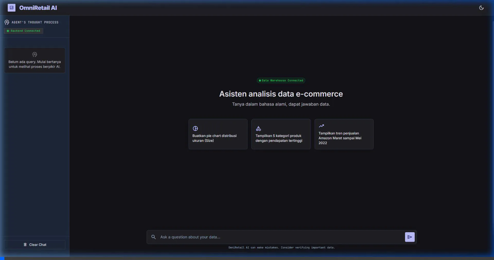
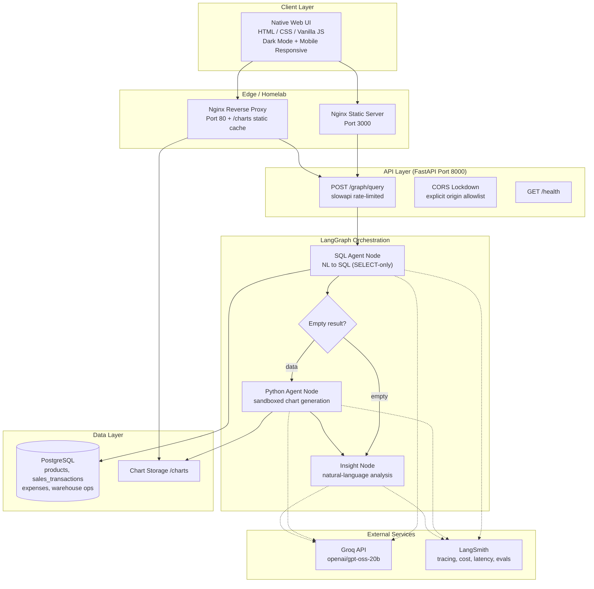
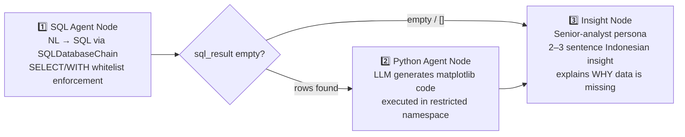

# OmniRetail AI 🤖

**Agentic E-commerce Data Analysis Chatbot — LangGraph · FastAPI · Groq · Native Web**

<div align="center">
  
</div>


---

## 📋 Executive Summary

**OmniRetail AI** is an advanced data-analysis chatbot that lets non-technical users query an e-commerce sales warehouse (Amazon + International platforms, products, expenses) in **natural language** — returning a SQL result table, an auto-generated chart, and a written business insight.

Unlike traditional document-based RAG, this project implements **Advanced Agentic RAG for Structured Data**, orchestrating a dynamic workflow that translates intent into executable code. It creatively combines three distinct AI topics into one cohesive product: **Natural Language Processing** (Text-to-SQL), **Generative Data Visualization** (Autonomous Python execution), and **Enterprise LLMOps**.

The system is built as a **3-node LangGraph pipeline** (SQL Agent → Python Agent → Insight Node) orchestrated behind a robust **FastAPI** backend, powered by **Groq** for sub-second LLM inference, and traced end-to-end with **LangSmith** for granular cost, latency, and quality evaluation.

Key outcomes:

- 🗣️ **Natural-language → SQL → Chart → Insight** in a single request (< 30s for complex queries)
- 🧱 **Glass-box AI** — the UI exposes the agent's "thought process" (raw SQL + executed Python) in a dedicated sidebar
- 🔒 **Defense-in-depth security** — SQL whitelist, sandboxed Python execution, CORS lockdown, rate limiting
- 🎨 **Native Web UI** with Dark Mode and full mobile responsiveness — no heavyweight frontend framework
- 🏠 **Dockerized Deployment** behind an Nginx reverse proxy, ready for seamless migration to **Cloud platforms** (AWS/GCP/DigitalOcean).
- 📊 **LLMOps Integration** — Comprehensive tracking of token usage, latency, and costs via LangSmith.

---

## 🏗️ System Architecture



**Request lifecycle:** the browser submits a query to `POST /graph/query` → FastAPI validates and rate-limits → the compiled LangGraph runs its 3-node pipeline → the response (`sql_result`, `python_code`, `chart_path`, `final_response`) is rendered as a chat bubble + data table + chart image. Charts are served directly by Nginx from a shared volume.

---

## 🧠 LangGraph Workflow Design (3 Nodes)



| Node | Responsibility | Failure handling |
|------|----------------|-------------------|
| **SQL Agent** | Prompt-engineered NL→SQL with schema-awareness rules (platform column, SKU hygiene, `COALESCE` NULL handling), executed read-only against PostgreSQL | Out-of-scope questions return a refusal marker, never a fabricated query |
| **Python Agent** | Generates ```python``` chart code from the SQL JSON; executed with a **restricted namespace** (only `pandas`, `matplotlib`, `numpy`, `json`) and a dangerous-pattern blocklist; saves PNG to `/charts` | Blocked/failed code degrades gracefully — table still renders |
| **Insight Node** | Converts data (or the *absence* of data) into a concise business insight; for empty results it explains specifically why the data might be missing instead of inventing date ranges | LLM failure falls back to a neutral message while keeping the table/chart |

The conditional edge (`should_run_python`) skips chart generation for empty result sets — so asking about a month with no sales still produces a *useful explanation* instead of an error.

---

## 🛠️ Tech Stack & Dependencies

| Layer | Technology |
|-------|-----------|
| **Frontend** | Native HTML / CSS / Vanilla JS — hand-crafted design-token system (CSS custom properties), **Dark Mode** (`localStorage`-persisted), mobile-first responsive drawer sidebar, XSS-safe markdown rendering (marked + DOMPurify) |
| **Serving / Edge** | Nginx (static UI + reverse proxy + chart caching), Docker Compose |
| **API** | FastAPI, Uvicorn, Pydantic v2, **slowapi** rate limiting |
| **Orchestration** | **LangGraph** StateGraph (3 nodes + conditional routing) |
| **LLM** | **Groq** — `openai/gpt-oss-20b` (temperature 0) via `langchain-groq` |
| **LLMOps** | **LangSmith** — tracing, token/cost tracking, latency profiling, LLM-as-a-Judge evaluators (Code Checker & Answer Relevance) |
| **Data** | PostgreSQL 15, SQLAlchemy 2.0, pandas, numpy, matplotlib (Agg backend) |
| **Security** | SQL whitelist (SELECT/WITH only + keyword blocklist), sandboxed `exec()` (restricted namespace + pattern blocklist), CORS origin allowlist, per-IP rate limits |

---

## 🚀 Getting Started / Local Setup

### Prerequisites

- Python 3.12+, Docker & Docker Compose
- A reachable **PostgreSQL** instance (homelab VM, container, or local)
- API keys: [Groq](https://console.groq.com) and [LangSmith](https://smith.langchain.com)

### 1. Configure environment

```bash
git clone https://github.com/Atha-Dzaky/OmniRetail-AI.git
cd OmniRetail-AI
cp .env.example .env
# Fill in: DATABASE_URL, GROQ_API_KEY, LANGSMITH_API_KEY
```

### 2. Initialize the database & load data

```bash
pip install -r requirements.txt
python scripts/setup_database.py        # create schema
python scripts/load_csv_data.py         # ETL: clean CSVs → PostgreSQL
```

> The e-commerce dataset (Amazon Sale Report, International sales, expenses, warehouse comparisons) is stored locally under `dataset/` and intentionally **not tracked** by git.

### 3. Run everything with Docker

```bash
docker compose up -d
```

| Service | URL | Purpose |
|---------|-----|---------|
| `frontend` | http://localhost:3000 | Native Web UI (Nginx static) |
| `app` | http://localhost:8000 | FastAPI backend + LangGraph |
| `nginx` | http://localhost | Reverse proxy + `/charts` static cache |

Verify the stack: `curl http://localhost:8000/health` → `{"status": "ok", "database": "connected"}`

### 4. Or run in dev mode

```bash
uvicorn app.main:app --reload          # backend, port 8000
cd FrontEnd && python -m http.server 3000   # UI, port 3000
```

---

## 💬 Example User Interactions

> **User:** *"Bandingkan penjualan Amazon vs International"*
> **System:** Generates a GROUP BY platform query with `COALESCE` NULL handling → renders a comparison table → matplotlib bar chart → 2-sentence insight on the platform gap.

> **User:** *"Tampilkan 5 produk dengan stok paling banyak"*
> **System:** Filters dummy SKUs (`SHIPPING`, `#REF!`), returns the top-5 inventory table, stock chart, and a restocking recommendation.

> **User:** *"Buatkan pie chart distribusi ukuran (Size)"*
> **System:** JOINs `sales_transactions` with `products` (size lives in the products table), computes the distribution, and renders the pie chart via the sandboxed Python Agent.

**Empty-result intelligence:** asking for a month/platform combination with no records (e.g., International sales in a month where the column is entirely NULL) routes directly to the Insight Node, which explains *why* the data is missing based on database context — instead of returning a generic error.

---

## 🔐 Security & LLMOps Features

### Security (defense in depth)

| Control | Implementation |
|---------|---------------|
| **SQL Whitelist** | Only `SELECT` / `WITH` statements pass; token-level blocklist rejects `DROP`, `DELETE`, `UPDATE`, `INSERT`, `ALTER`, `CREATE`, `TRUNCATE`, `GRANT`, `REVOKE` (`app/graph.py`) |
| **Sandboxed Python** | LLM-generated code runs via `exec()` in a **restricted namespace** (pandas / matplotlib / numpy / json only) with a dangerous-pattern blocklist (`import os`, `subprocess`, `eval`, `open`, network libs, …) |
| **CORS Lockdown** | Explicit origin allowlist (`localhost:3000`, homelab IPs) — no wildcards in production |
| **Rate Limiting** | `slowapi` per-IP limits — 60 req/min global, 10 req/min on the LLM endpoint (`POST /graph/query`) |
| **Input Validation** | Pydantic-enforced query schema (1–2000 chars) + frontend length guard |
| **XSS Protection** | All LLM/database output is HTML-escaped; markdown rendered through DOMPurify |

### LLMOps

- **LangSmith tracing** on every LLM call (SQL generation, chart code, insight) with project-scoped dashboards
- **Cost & latency tracking** — token usage per request, p50/p95 latency profiling
- **LLM-as-a-Judge evaluators**
  - *Code Checker* — validates generated Python executes and produces the expected artifact
  - *Answer Relevance* — scores the final insight against the user's question
- **Structured logging** at every graph node for debugging agent behavior in production

---

## 📁 Project Structure

```
├── app/
│   ├── main.py            # FastAPI app, CORS, rate limiting, static charts
│   ├── graph.py           # LangGraph 3-node pipeline + security guards
│   ├── agent.py           # Query logging (JSONL)
│   ├── db.py / models.py  # SQLAlchemy engine & schema
│   └── routers/           # /graph, /health, /products
├── FrontEnd/              # Native Web UI (index.html, style.css, script.js)
├── nginx/                 # Reverse proxy + static chart caching
├── scripts/               # DB setup, CSV ETL, dev helpers
├── migrations/sql/        # Schema constraints
├── docker-compose.yml     # app + frontend + nginx
└── Dockerfile             # Python 3.12-slim production image
```

---

## 📄 License

MIT © 2026 Atha Dzaky Hidayanto — see [LICENSE](LICENSE).
